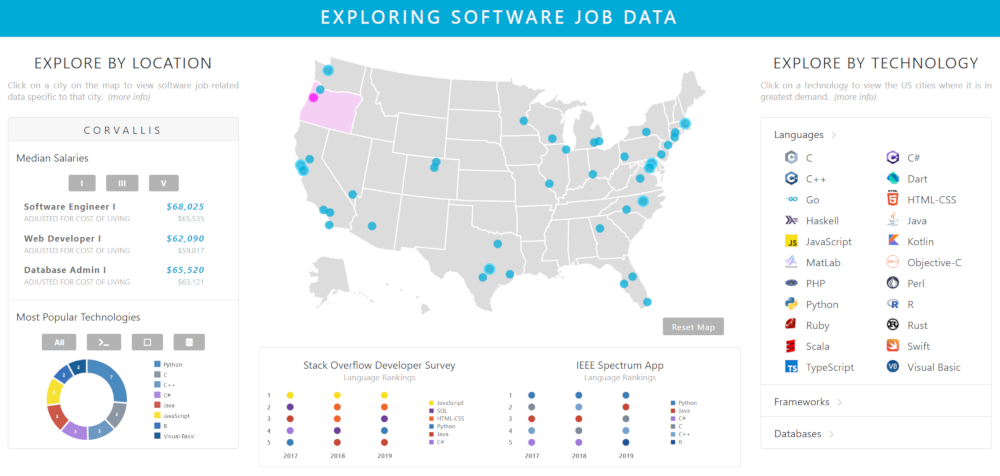
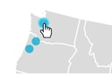
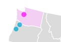
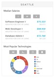
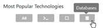
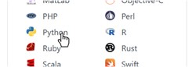
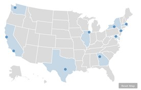
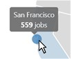
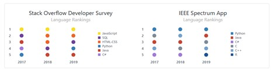

# Software Job Data Visualization App
Capstone (Senior) Project: A single-page web application for the interactive visual display of software job-related data, written in JavaScript, D3.js, HTML/CSS, and Bootstrap.
The site originally served as the front end to a full-stack web application which collected, stored, and served web-scraped job listing and salary data, utilizing Python, Django, BeautifulSoup, and SQLite. Now detached from the back end, the application utilizes randomized data to demonstrate proof of concept. 

Personal contributions to the project included:
* complete front end UX and UI design and implementation
* initial scraping research
* aggregation of language popularity and cost of living data
* assistance with Django QuerySet API
* back end debugging

This application is designed for and best viewed on **desktop** and has reduced functionality on mobile devices.

### Site Access
https://ejbevil.github.io/sw-job-data-viz/ \
OR \
Download project. Open `index.html` in preferred browser.

### App Navigation
*Explore by City* \
Click on a city on the map to view detailed data for that city, including average and cost of living-adjusted salaries for several job roles and the most in-demand technologies (all values now randomized). \
   \
 \
Toggle between career levels and technology types to display additional data. \
 

*Explore by Technology* \
Click on a technology in the right drop-down menu to select a technology (programming language, framework, or database) to view the cities where it is in highest demand. \
 \
 \
Hover over displayed cities to view a count of job listings requesting that technology (all values now randomized). \
[*feature not available on mobile*] \
 \
Click Reset Map to clear currently displayed top cities. \
 

*View Survey Data* \
View static language popularity data at the bottom of the page. Click on graph subtitle to view source data. \
[*feature not available on mobile*] \

